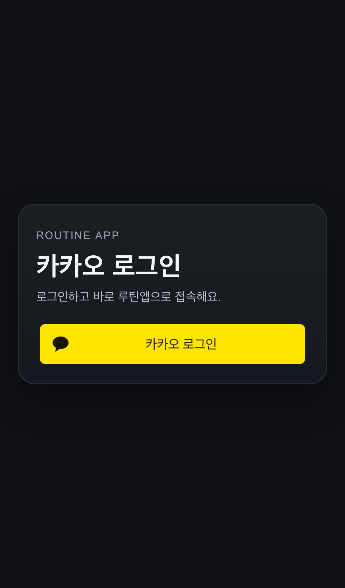

맞습니다. 원인 정확히 잡았습니다.

- `raw.githubusercontent.com` 기반 링크는 **private repo 권한 컨텍스트에서 404**가 날 수 있습니다.
- `blob?...raw=1`도 환경/권한에 따라 불안정합니다.

그래서 최종적으로 **PR 컨텍스트 상대경로**로 고정합니다. (private 권한을 그대로 타서 가장 안정적)

직접 열기(동일 파일):
- `docs/screenshots/2026-03-20-auth-kakao-entry-ui-v2.png`

앞으로 스크린샷 규칙:
1) 파일은 리포에 커밋
2) PR 본문/코멘트에는 상대경로만 사용
3) 링크 검증 후 공유