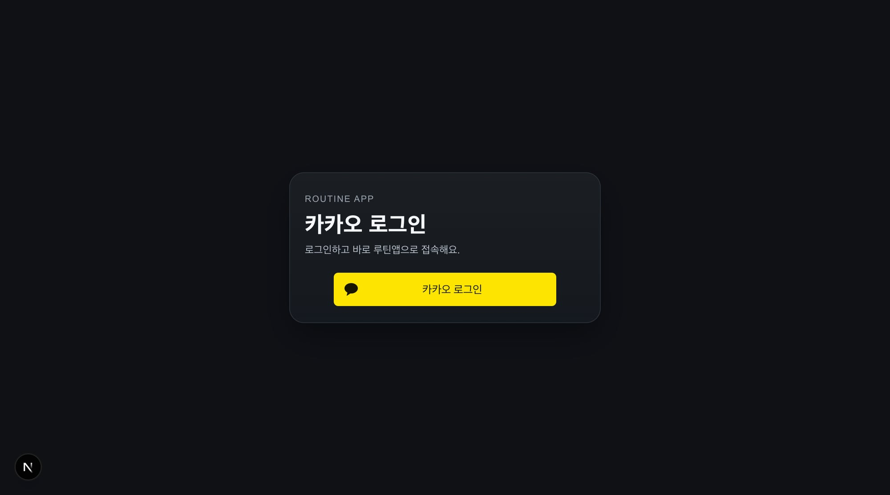

## 📌 PR 요약
카카오 로그인 직후 첫 진입 UX를 개선하고, 인증 대기 화면 톤을 통일했습니다.

- 로그인 완료 후 `/today` 진입 시 1회성 웰컴 피드백 노출
- `AuthRequired` 로딩 화면을 auth 톤의 공통 UI로 통일
- 카카오 실연동 전에는 버튼 클릭 시 mock 로그인처럼 동작하도록 처리
- 모바일 WebView에서 `/auth` 경로일 때 헤더/하단탭 숨김 동기화 강화

## 🔎 문제 재현 (Before)
1. 비로그인 상태로 `/today` 또는 `/friends` 접근
2. `/auth` 진입 후 로그인 완료
3. 기존에는 첫 진입 체감 피드백이 약하고, 인증 대기 화면이 단순 텍스트라 톤이 분리됨
4. 모바일에서 `/auth`인데 헤더/하단탭이 보이는 케이스 존재

## 🧠 원인
- 로그인 직후 1회성 상태 전달값이 없었음
- 인증 대기 UI가 공통 컴포넌트로 관리되지 않았음
- WebView 라우트 경로 동기화가 불안정해 auth 화면 판별이 늦는 순간이 있었음

## ✅ 해결 (After)
- `sessionStorage` 플래그로 로그인 직후 웰컴 피드백 전달/소비
- `AuthStatusScreen` 공통 컴포넌트로 인증 대기 UI 통일
- 카카오 mock 로그인 키(`routine-auth-mock-login`)로 실연동 전 동작 보장
- WebView route-path 브리지 강화로 `/auth`에서 헤더/바텀탭 숨김 고정

### 변경 파일
- `apps/web/src/app/auth/page.tsx`
- `apps/web/src/app/today/today-view.tsx`
- `apps/web/src/components/auth-required.tsx`
- `apps/web/src/components/auth-status-screen.tsx`
- `apps/web/src/lib/auth-entry-feedback.ts`
- `apps/mobile/App.tsx`

## 🧪 테스트
- ✅ `apps/web`: `npm run test`
- ✅ `apps/web`: `npm run lint` (error 0, 기존 warning 4)
- ✅ `apps/web`: `npm run build`
- ✅ `apps/mobile`: `npm run test`

## 📷 스크린샷 (PR에서 직접 보이게 첨부)
### 1) Auth Entry Login Card

### 2) Auth Required Unified

## ⚠️ 영향도 / 리스크
- 영향 범위: web(auth/today), mobile(webview shell)
- 리스크: mock 로그인은 임시 정책이므로 카카오 실연동 시 제거 필요
- 롤백: PR revert
