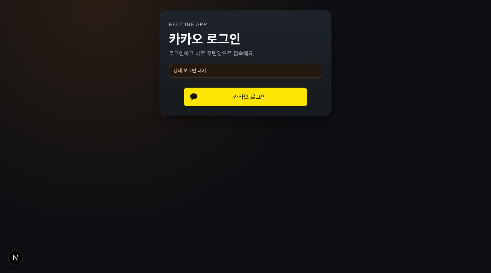
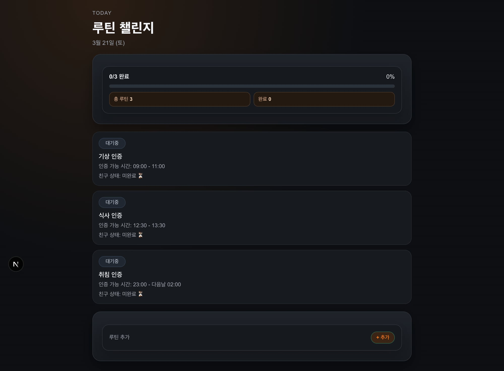
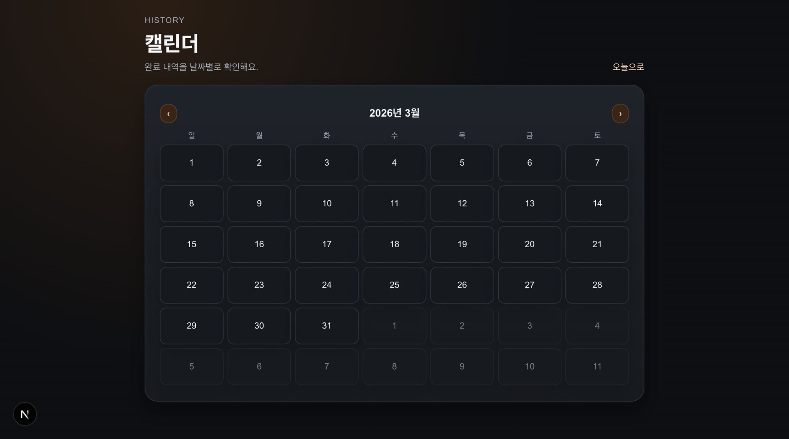

## 📌 PR 요약
PR #76 머지 이후 후속 UI 작업분을 별도 PR로 분리합니다.

- 공통 디자인 토큰/컴포넌트 기반 추가
- `/today`, `/calendar`에 디자인 시스템 적용 확장
- Storybook 도입으로 공통 컴포넌트/토큰 확인 경로 제공
- 사용자 제공 레퍼런스 이미지 저장 및 기준 문서화
- auth/today/calendar 화면 카드 계층(간격/radius/shadow) 일관화

## 🔎 재현 (Before)
- PR #76 이후 후속 작업이 같은 브랜치에서 계속 진행됨
- 머지된 PR에 코멘트/추가 변경이 혼재되어 리뷰 추적 어려움
- 화면별 카드 밀도/간격이 달라 시각 계층이 들쭉날쭉함

## 🧠 원인
- 머지 이후 브랜치 분리 없이 후속 개선을 이어서 작업함
- 디자인 토큰 도입 이후 페이지별 인라인 스타일 정렬이 미완료 상태였음

## ✅ 해결 (After)
- 후속 변경을 새 PR로 분리해 리뷰 단위를 복원
- auth/today/calendar에 공통 토큰 기준 spacing/radius/shadow 재정렬
- 사용자 실제 표시 화면 기준 스크린샷 재첨부

## 🧪 QA
- `apps/web npm run test` 통과
- `apps/web npm run build` 통과
- `apps/mobile npm run test` 통과
- lint는 저장 산출물(`storybook-static`) 영향으로 기존과 동일하게 실패(본 변경 무관)

## 📷 스크린샷 (사용자 표시 기준)

## ⚠️ 리스크
- 없음 (스타일/레이아웃 미세조정 범위)
