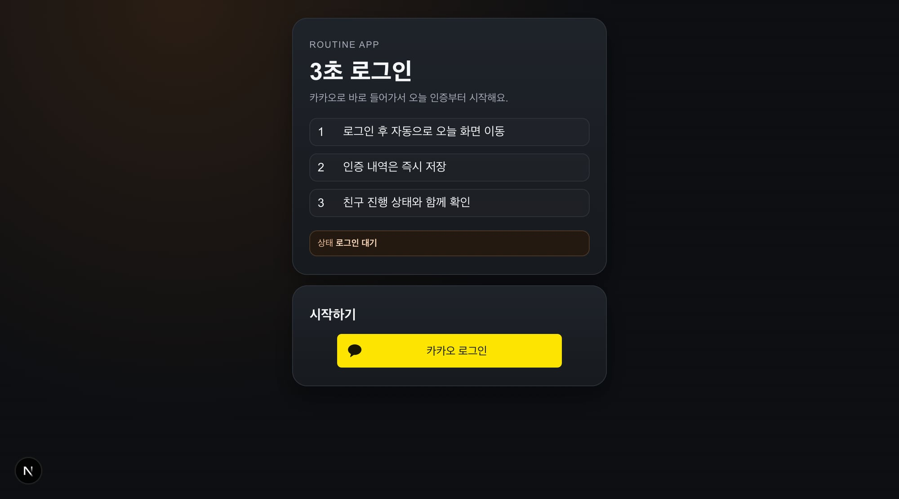
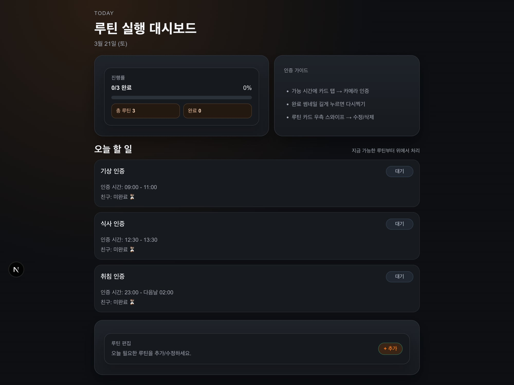
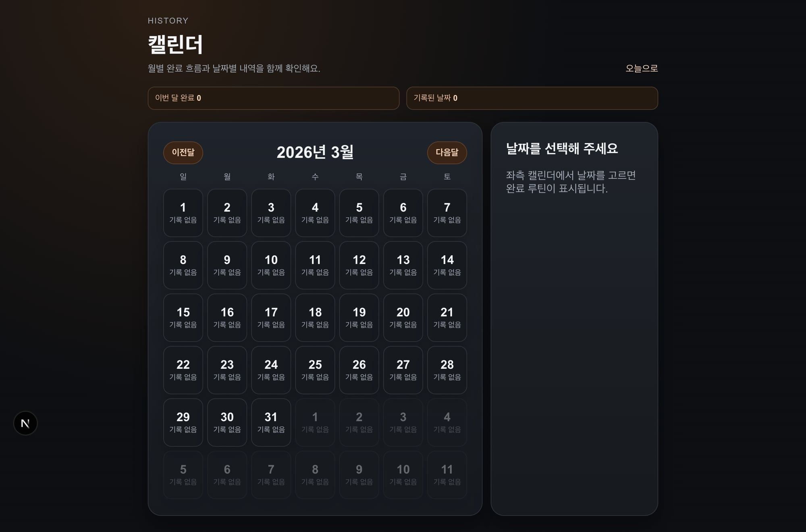

## 📌 PR 요약
PR #76 이후 후속 UI를 **폴리시가 아니라 구조 재설계**로 다시 작업했습니다.

- `/auth`, `/today`, `/calendar` 레이아웃 구조 재작성
- 페이지별 정보 우선순위(핵심 행동/상태/보조정보) 재배치
- 사용자 표시 기준 스크린샷 v2 반영

## 🔎 재현 (Before)
- 기존 화면은 카드/텍스트 스타일만 조정된 상태로, 화면 구조 자체는 이전과 유사
- "처음부터 다시" 요구 대비 레이아웃 변화가 부족

## 🧠 원인
- 요구를 리디자인(구조 재작성)보다 리스타일(색/간격 보정)로 오해

## ✅ 해결 (After)
- auth: 소개/가이드/CTA를 분리한 2-카드 진입 구조로 재작성
- today: KPI + 가이드 + 실행 보드 + 편집 영역의 4단 구조로 재작성
- calendar: 월 캘린더 + 상세 패널의 2컬럼 구조로 재작성

## 🧪 QA
- `apps/web npm run build` 통과

## 📷 스크린샷 (v2)

## ⚠️ 리스크
- 기능 변경 없이 레이아웃 재배치 중심 (UI 회귀는 리뷰에서 확인 필요)
