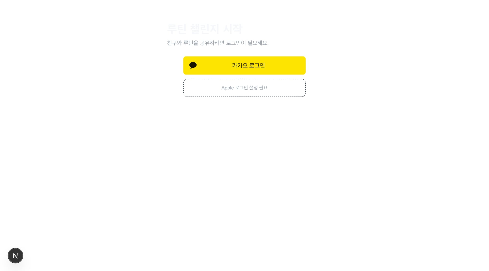
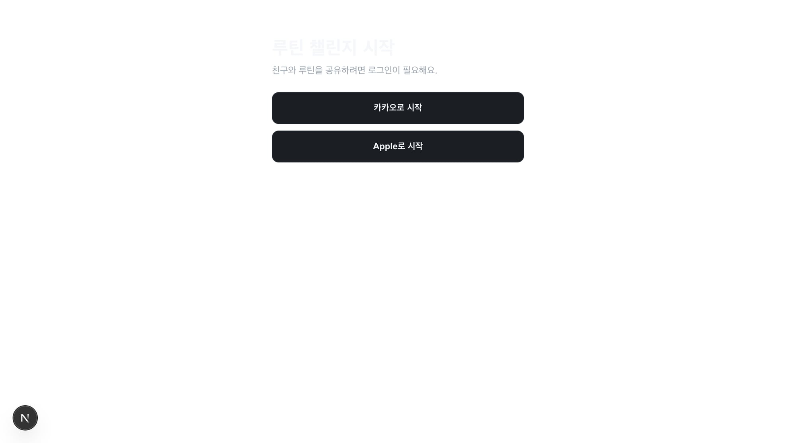
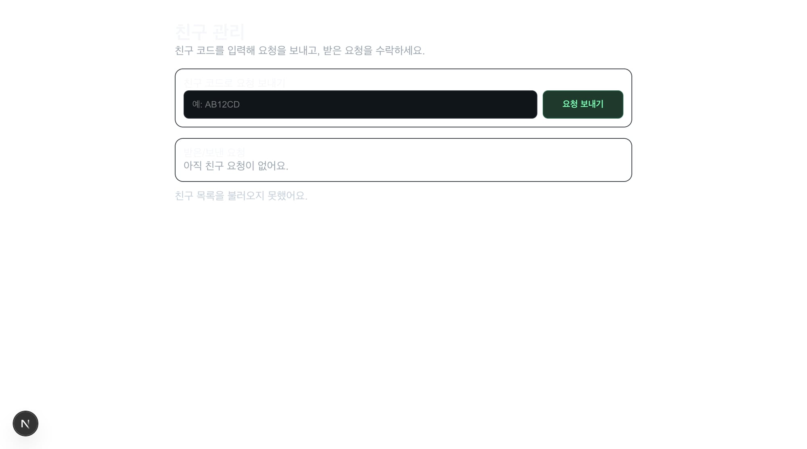

## 📌 PR 요약
카카오 로그인 플로우를 앱(WebView) 기준으로 안정화하고, 실패/취소 UX와 세션 복구를 포함해 P0 인증 흐름을 마무리했습니다.

- `/auth` 콜백/복귀 경로를 고정해 로그인 후 원래 보호 페이지로 안정 복귀
- 카카오 로그인 실패/취소 케이스를 분리해 사용자 메시지 개선
- 세션 반영 지연 상황을 재시도 기반으로 복구하도록 auth 체크 로직 보강
- 모바일에서 `/auth` 경로 시 탭/헤더 숨김 + OAuth 이동 WebView 내부 유지

## 🔎 문제 재현 (Before)
- [x] 재현 절차를 적었다
- [x] 기존 동작/에러를 캡처했다 (로그, 스크린샷, 영상 중 1개)

재현 절차:
1. 비로그인 상태에서 `/friends` 접근
2. `/auth?next=/friends`에서 카카오 로그인 진행
3. 로그인 완료 후 복귀/세션 반영 상태 확인

기존 결과:
- 로그인 완료 후 `/auth`에 잔류하거나 복귀 경로가 흔들릴 수 있었음
- 취소/실패 케이스가 단일 에러 문구로만 표시됨

## 🧠 원인
- OAuth `redirectTo`가 콜백 후 후처리를 일관되게 거치지 않는 경로로 설정돼 복귀 제어가 약했음
- callback query(`error`, `error_description`) 기반 분기 처리가 없어서 UX가 모호했음
- 세션 체크가 단발성이라 callback 직후 지연 반영 타이밍을 흡수하지 못함
- 앱 WebView에서 auth 화면도 일반 화면처럼 렌더링되어 UX 분리 부족

## ✅ 해결 (After)
- OAuth callback을 `/auth?next=...`로 고정하고, 성공 시 `ensureMyProfile()` 후 복귀
- `next`를 query + sessionStorage 이중 보관해 복귀 경로 유실 방지
- auth 실패/취소 메시지를 분리 매핑하고 `다시 시도하기` 액션 제공
- `getSessionWithRecovery()` 유틸 도입으로 session 확인 재시도
- 모바일 `/auth` 경로에서 헤더/탭 숨김, OAuth 이동을 WebView 내부 허용

변경 사항:
- `apps/web/src/app/auth/page.tsx`
- `apps/web/src/components/auth-required.tsx`
- `apps/web/src/lib/auth-error.ts`
- `apps/web/src/lib/session-recovery.ts`
- `apps/mobile/App.tsx`
- `docs/kakao-login-setup-checklist.md`
- `docs/kakao-login-master-design.md`
- `docs/challenge-progress.md`

## 🎯 MVP 범위 / 우선순위
- [x] MVP 필수 범위만 포함
- [x] Nice-to-have는 제외 또는 후속 이슈로 분리

이번 PR 우선순위:
- P0(필수): 카카오 로그인 성공/실패/복귀/세션복구 안정화
- P1(중요): friends 진입 연동 QA
- P2(후순위): lint warning 정리 및 UI 디테일 개선

## 🧪 테스트
- [x] 로컬 실행 확인 (`npm run dev` 등)
- [x] 핵심 시나리오 수동 테스트
- [x] 회귀 영향 확인

테스트 시나리오:
- 비로그인 `/today` → `/auth?next=/today` → 로그인 후 `/today` 복귀
- 비로그인 `/friends` → `/auth?next=/friends` → 로그인 후 `/friends` 복귀
- 로그인 취소/실패 시 분리 메시지 노출 + 재시도
- 앱에서 `/auth` 화면 탭/헤더 숨김

결과:
- [x] 통과
- [ ] 미통과(아래에 상세)

추가 검증:
- `apps/web npm test` 통과 (29 tests)
- `apps/web npm run lint` 에러 0 (기존 warning 4)
- `apps/web npm run build` 통과
- `apps/mobile npm test` 통과

## 📷 증빙
- Before/After 인증 가드/복귀 관련:
  - 
  - 
- 로그인/친구 페이지 화면:
  - 
  - 

## ⚠️ 영향도 / 리스크
- 영향 범위: web, mobile
- 리스크:
  - Kakao Redirect URI / Supabase callback URI 불일치 시 실환경 실패 가능
  - 일부 기기 WebView 세션 반영 편차 가능성
- 롤백 방법:
  - 해당 PR revert 후 이전 auth 경로로 복귀

## 🗂️ 관련 이슈
- Closes #
- Related #

## 🔁 배포/마이그레이션 체크
- [ ] 환경변수 변경 없음
- [x] 환경변수 변경 있음 (문서/시크릿 반영 완료)
- [x] DB 마이그레이션 없음
- [ ] DB 마이그레이션 있음 (적용/롤백 절차 기재)

## 📝 리뷰어 가이드
- 중점 리뷰 포인트 1~3개
1. `/auth` callback 경로 고정 및 `next` 복귀 로직 안전성
2. session-recovery 재시도 로직의 부작용(무한 루프/지연) 여부
3. 모바일 auth 화면 분리(탭/헤더 숨김)와 OAuth WebView 유지 동작
