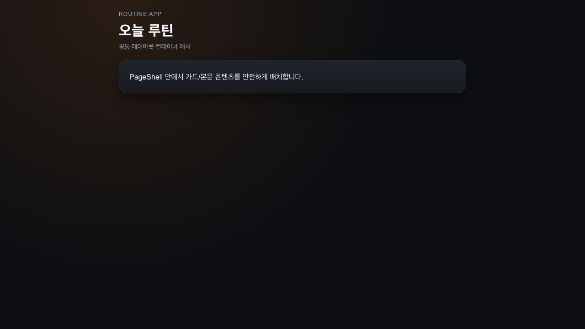
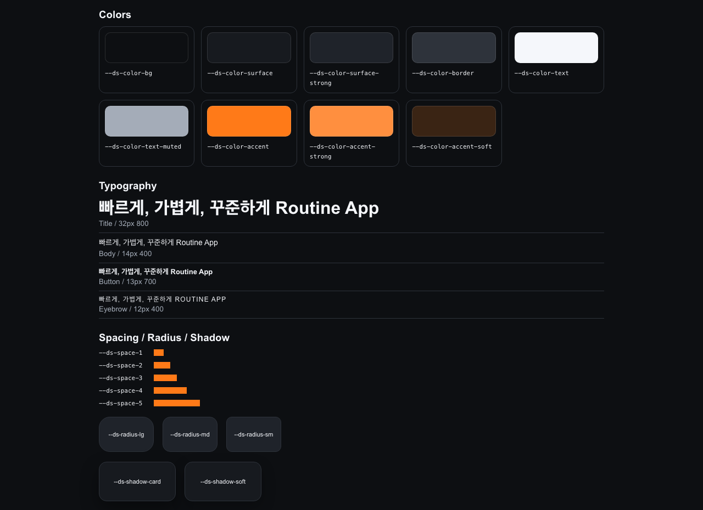
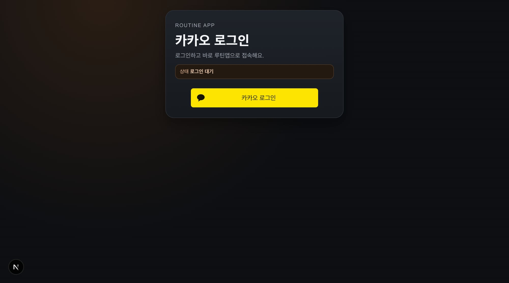

## 📌 PR 요약
PR #76 머지 이후 후속 UI 작업분을 별도 PR로 분리합니다.

- 공통 디자인 토큰/컴포넌트 기반 추가
- `/today`, `/calendar`에 디자인 시스템 적용 확장
- Storybook 도입으로 공통 컴포넌트/토큰 확인 경로 제공
- 사용자 제공 레퍼런스 이미지 저장 및 기준 문서화

## 🔎 재현 (Before)
- PR #76 이후 후속 작업이 같은 브랜치에서 계속 진행됨
- 머지된 PR에 코멘트/추가 변경이 혼재되어 리뷰 추적 어려움

## 🧠 원인
- 머지 이후 브랜치 분리 없이 후속 개선을 이어서 작업함

## ✅ 해결 (After)
- 후속 변경을 새 PR로 분리해 리뷰 단위를 복원

## 🧪 QA
- `apps/web npm run test` 통과
- `apps/web npm run lint` 에러 0 (warning only)
- `apps/web npm run build` 통과
- `apps/mobile npm run test` 통과

## 📷 스크린샷

## ⚠️ 리스크
- 일부 캡처는 auth gate 상태에서 촬영되어 본문 상태 증빙은 후속 캡처가 필요
